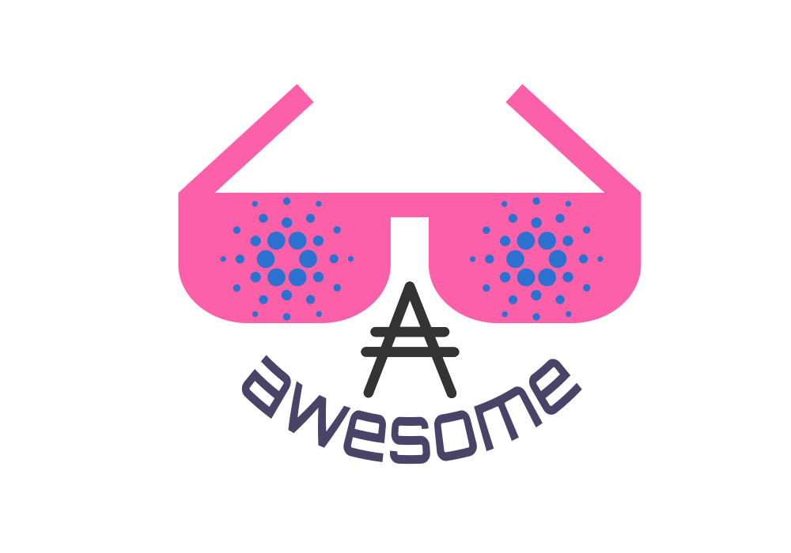

   
  
   
   

## Awesome Cardano 

> A curated list of awesome things related to the Cardano project

- [Resources](#resources)
    - [Official Resources](#official-resources)
    - [External Resources](#external-resources)
    - [Community](#community)
        - [Community Github Projects](#community-github-projects)
- [ADA Exchanges](#exchanges)

# Resources

### Official Resources

#### Cardano
- [Official Website](https://www.cardano.org/)
- [Official Roadmap](https://cardanoroadmap.com/)
- [Official Wallet](https://daedaluswallet.io/) [(Download)](https://daedaluswallet.io/#download)
- [Official Blockchain Explorer](https://cardanoexplorer.com/)
- [Official Whitepaper - Philosophy](https://whycardano.com/) [(Download PDF)](https://whycardano.com/assets/WhyCardanoEN.pdf)
- [Official Whitepaper - Academic Research](https://www.cardanohub.org/en/academic-papers/)
- [Official Documentation](https://cardanodocs.com/)
- [Official GitHub Repo](https://github.com/input-output-hk/cardano-sl)
- [Official Help Center](https://help.cardano.org/)
- [Official Forum](https://forum.cardano.org/)
- [Official Twitter](https://twitter.com/cardanocom/)
- [Official SubReddit](https://www.reddit.com/r/cardano/)
- [Official Chat](https://chat.cardano.org/)

#### Cardano Foundation
- [Official Website](https://cardanofoundation.org/)
- [Official Youtube Channel](https://www.youtube.com/channel/UCbQ9vGfezru1YRI1zDCtTGg)
- [Official Twitter](https://twitter.com/CardanoStiftung)

#### IOHK
- [Official Website](https://iohk.io/)
- [Official Team](https://iohk.io/team/)
- [Official Academic Papers](https://iohk.io/research/papers/)
- [Official Blog](https://iohk.io/blog/)
- [Official GitHub Repo](https://github.com/input-output-hk/)
- [Official Youtube Channel](https://www.youtube.com/channel/UCBJ0p9aCW-W82TwNM-z3V2w)

#### Emurgo
- [Official Website](https://emurgo.io/)
- [Official Twitter](https://twitter.com/emurgo_io)
- [Official Facebook](https://www.facebook.com/emurgo.io/)

### External Resources
- [Cardano Wiki](https://cardanowiki.info)

### Community Social
- 
- 

### Community Github Projects
- [Cardano Monitor](https://github.com/Quantumplation/cardano-monitor)
- [Cardano SL Alpine](https://github.com/sharkspeed/cardano-sl-alpine)
- [Cardano Daedalus Docker](https://github.com/hcvst/cardano-daedalus-docker)

### (Community Built Resources)
- [ADA Tracker](https://adatracker.com/)
- [ADA Check](https://adacheck.io/)
- [ADA USD](https://adausd.bid/)
- [How Much Is My ADA Worth](https://howmuchismyadaworth.com/)

### (Community News & Commentary)
https://itunes.apple.com/us/podcast/lets-talk-cardano/id1329422620?mt=2
https://www.youtube.com/channel/UCdMyiIdAqr6lVX7tTCfhHFA
https://m.ada.st/about

### Exchanges
- [Official Buy & Sell ADA](https://www.cardano.org/en/buy-sell-ada/)
- [Bittrex](https://bittrex.com/)
- [Binance](https://www.binance.com/)
- [BitMEX](https://www.bitmex.com/) - Futures market of BTC/ADA
- [Cryptopia](https://www.cryptopia.co.nz/) - Coming soon
- [HitBTC](https://hitbtc.com/)
- [UPBit](https://upbit.com/)

### List of Staking Pools
- [Cardano Wiki's List](https://cardanowiki.info/wiki/List_of_staking_pools)
- [Cardano Forum's List](https://forum.cardano.org/t/list-of-cardano-ada-staking-pools/7595)

### Needs Sorting:
https://sites.google.com/view/ada-in-th/home
https://www.ada.st/
